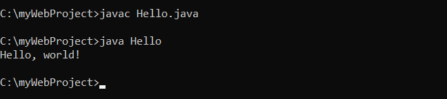
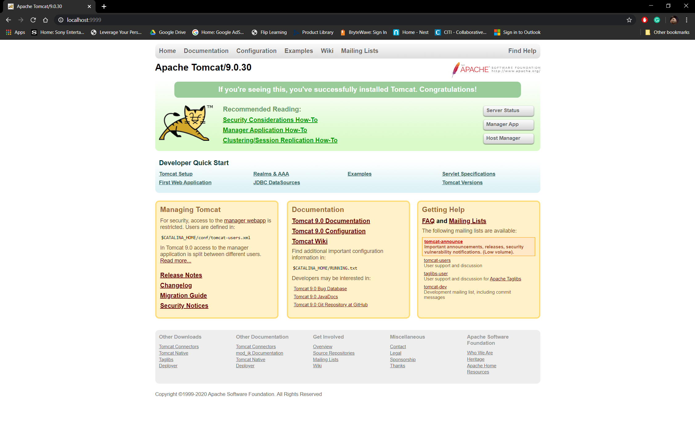

# LIS 4368 - Advanced Web Applications Development

## Juan D Carballo Sanchez

### Assignment 1 Requirements:
*Three Parts:*

  1. Distributed Version Control with Git and BitBucket
  2. Java/SP/Server Development Installation
  3. Chapter Questions (Chs 1-4)

  Git commands w/short descriptions

  1. git init - initializes a git repository for a new or existing project.
  2. git status - checks the status of files you've changed in your working directory
  3. git add - adds changes to stage/index in your working directory
  4. git commit - commits changes and sets it to new commit object for your remote
  5. git push - pushes your changes to the remote
  6. git pull - pulls the changes from your remote
  7. git clone - copies a git repository from remote source

  **Assignment Screenshots:**

  *Screenshot of running Java Hello:*

  

  *Screenshot of running Tomcat:*

  

  **Assignment Links:**

  *LIS 4368 Web App Link*

  [localhost lis4368](http://localhost:9999/lis4368)

  *Assignment 1 Repository*

  [A1 Repository Link](https://bitbucket.org/Dcj21/lis4368/src/master/)

  *Bitbucket Tutorial - Station Locations Repository:*

  [A1 Bitbucket Station Locations Tutorial Link](https://bitbucket.org/Dcj21/bitbucketstationlocations)
