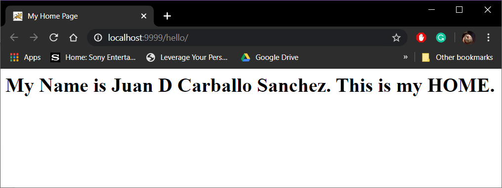
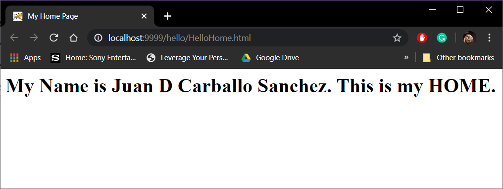
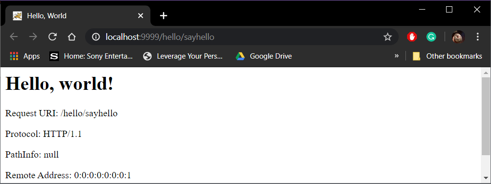
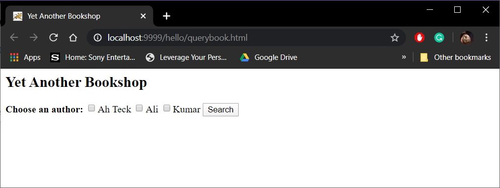
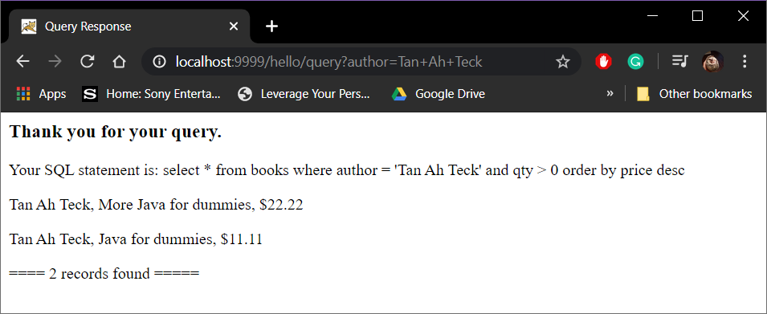
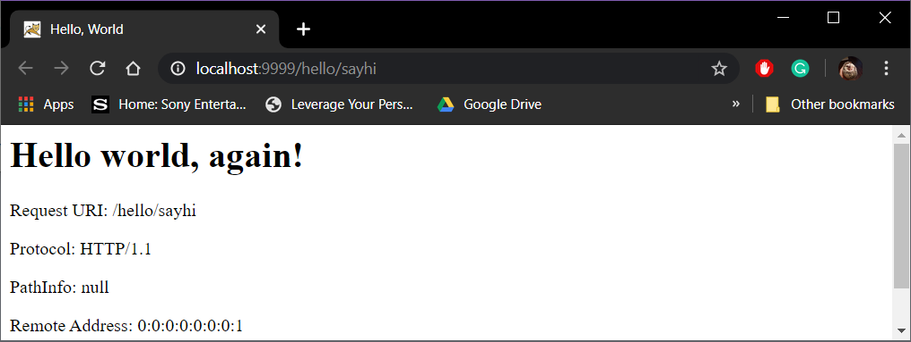

# LIS 4368 - Advanced Web Applications Development

## Juan D Carballo Sanchez

### Assignment 2 Requirements:

  a. http://localhost:9999/hello

  *Screenshot of Hello:*

  

  b. http://localhost:9999/hello/HelloHome.html

  *Screenshot of Hello Home:*

  

  c. http://localhost:9999/hello/sayhello

  *Screenshot of Hello Servlet:*

  

  d. http://localhost:9999/hello/querybook.html

  *Screenshot of Query Boook:*

  

  *Screenshot of Query Results:*

  

  e. http://localhost:9999/hello/sayhi

  *Screenshot of Another Hello Servlet:*

  

  *Assignment 2 Repository*

  [A2 Repository Link](https://bitbucket.org/Dcj21/lis4368/src/master/)
