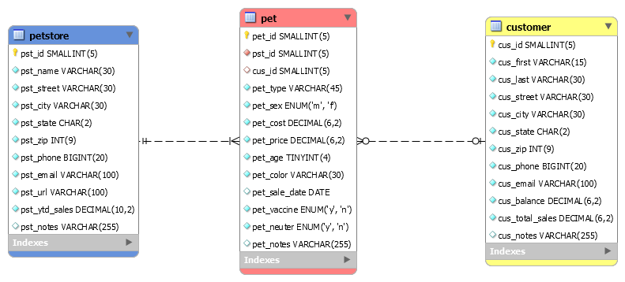

# LIS 4368 - Advanced Web Applications Development

## Juan D Carballo Sanchez

### Assignment 3 Requirements:

  A pet store owner, who owns a number of pet stores, requests that you develop a Web application
  whereby he and his team can record, track, and maintain relevant company data, based upon the
  following business rules:

  1. A customer can buy many pets, but each pet, if purchased, is purchased by only one customer.

  2. A store has many pets, but each pet is sold by only one store.

  *Screenshot A3 ERD*:

  

  *A3 docs: a3.mwb and a3.sql*:

  [A3 MWB File](docs/a3.mwb "A3 ERD in .mwb format")

  [A3 SQL File](docs/a3.sql "A3 SQL Script")

  *Main Repository*

  [Main Repository Link](https://bitbucket.org/Dcj21/lis4368/src/master/)
