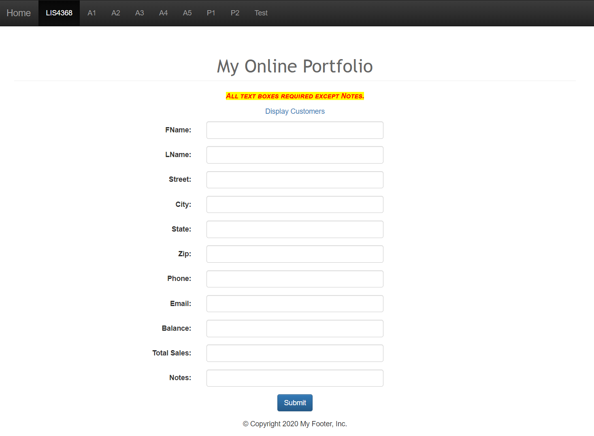
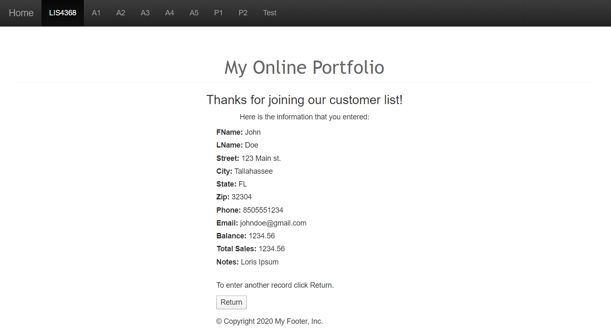

# LIS 4368 - Advanced Web Applications Development

## Juan D Carballo Sanchez

### Assignment 4 Requirements:

  **Deliverables:**

  1. Edit and compile CustomerServlet.java and Customer.java
  2. Screenshots of Project
    - Screenshot of A4 Failed Validation
    - Screenshot of A4 Passed Validation
  4. http://localhost:9999/lis4368/customerform.jsp?assign_num=a4

  **A4 Failed Validation**

  

  **A4 Passed Validation**

  

  [**Main Repository Link**](https://bitbucket.org/Dcj21/lis4368/src/master/)
