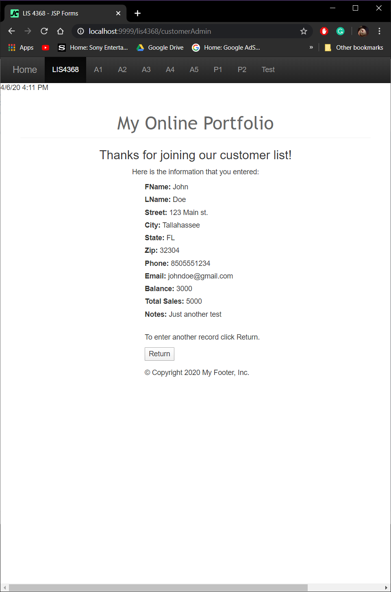
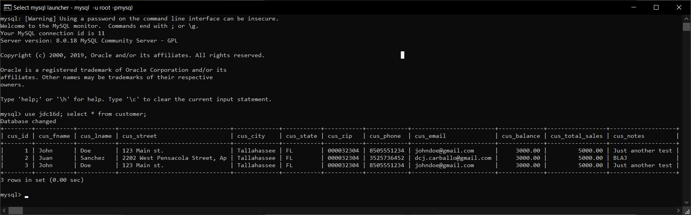

# LIS 4368 - Advanced Web Applications Development

## Juan D Carballo Sanchez

### Assignment 5 Requirements:

  **Deliverables:**

  1. Edit and compile Java files
  2. Screenshots of Assignment
    - Screenshot of A5 Valid User Entry
    - Screenshot of A5 Passed Validation
    - A5 Associated Database Entry
  4. http://localhost:9999/lis4368/customerform.jsp?assign_num=a5

  **Valid User Form Entry**

  

  **Passed Validation**

  

  **Associated Database Entry**

  

  [**Main Repository Link**](https://bitbucket.org/Dcj21/lis4368/src/master/)
