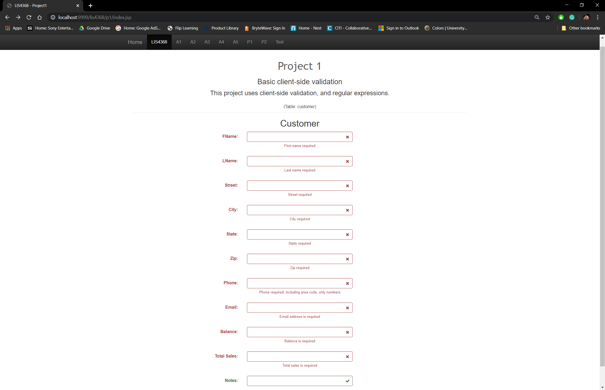
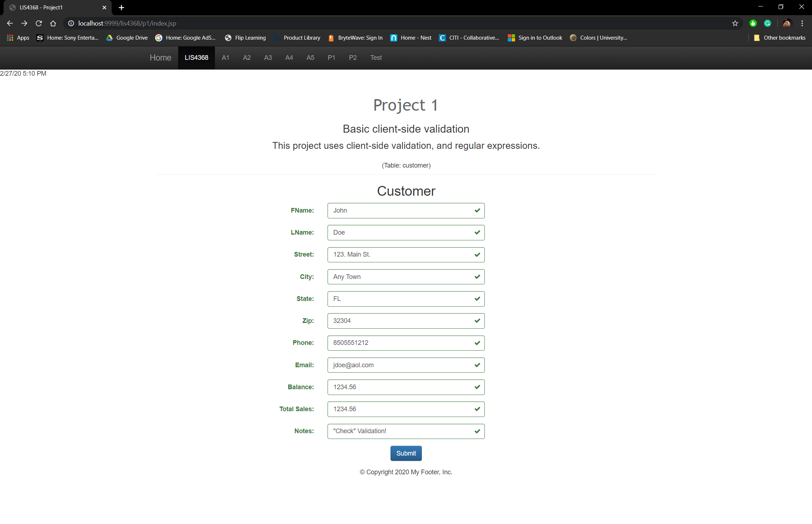

# LIS 4368 - Advanced Web Applications Development

## Juan D Carballo Sanchez

### Project 1 Requirements:

  Open index.jsp and review code:

    a. Suitably modify meta tags
    b. Change title, navigation links, and header tags appropriately
    c. Add form controls to match attributes of customer entity
    d. Add the following jQuery validation and regular expressions-- as per the entity
    attribute requirements (and screenshots below):
      i. *All* input fields, except Notes are required
      ii. Use min/max jQuery validation
      iii. Use regexp to only allow appropriate characters for each control:
      cus_fname, cus_lname, cus_street, cus_city, cus_state, cus_zip, cus_phone, cus_email, cus_balance, cus_total_sales, cus_notes
      fname, lname: provided
      street, city: no more than 30 characters
      Street: must only contain letters, numbers, commas, hyphens, or periods
      City: can only contain letters, numbers, hyphens, and space character (29 Palms)
      state: must be 2 characters, must only contain letters
      zip: must be between 5 and 9 characters, inclusive, must only contain numbers
      phone: must be 10 characters, including area code, must only contain numbers
      email: provided
      balance, total_sales: no more than 6 digits, including decimal point can only contain numbers, and decimal point (if used)
      iv. *After* testing jQuery validation, use HTML5 property to limit the number of characters for each control

  **LIS4368 Portal (Main/Splash Page)**:

  

  **Failed Validation**:

  

  **Passed Validation**:

  

  **Main Repository**

  [Main Repository Link](https://bitbucket.org/Dcj21/lis4368/src/master/)
