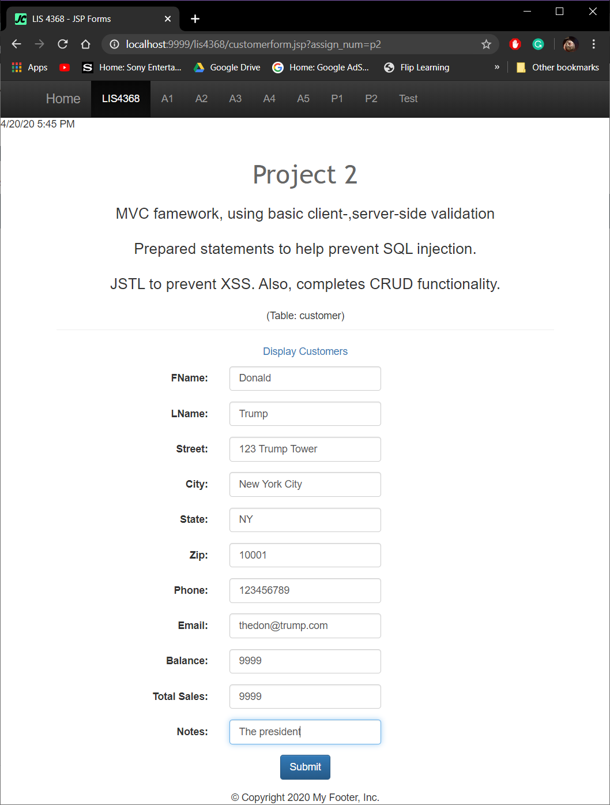

# LIS 4368 - Advanced Web Applications Development

## Juan D Carballo Sanchez

### Project 2 Requirements:

  These requirements complete the JSP/Servlets web application using the MVC framework and providing create, read, update and delete(CRUD) functionality--that is, the four basic functions of persistent storage. In addition a search (SCRUD) option could be added, and which will be left as a research exercise.

  **Deliverables:**

  1. Edit and compile Java files
  2. Screenshots of Project
    - Screenshot of P2 Valid User Entry and Pass Validation
    - Screenshot of P2 Modified Data Entries and Deletion
    - P2 Associated Database Entry
  4. http://localhost:9999/lis4368/customerform.jsp?assign_num=p2

  **Valid User Form Entry**

  

  **Passed Validation**

  

  **Display Data**

  

  **Modify Form**

  

  

  **Delete Warning**

  

  

  **Associated Database Entry**

  

  [**Main Repository Link**](https://bitbucket.org/Dcj21/lis4368/src/master/)
